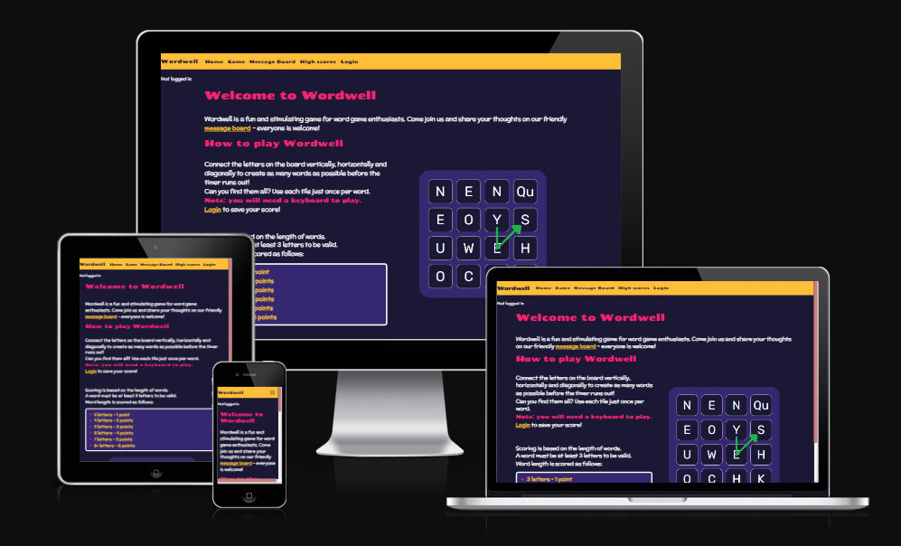
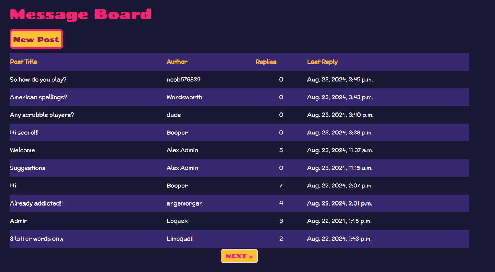
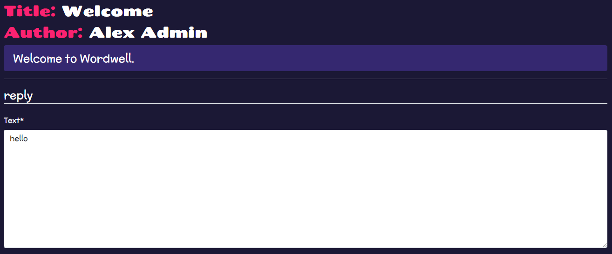
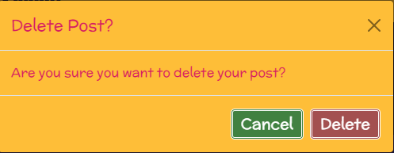
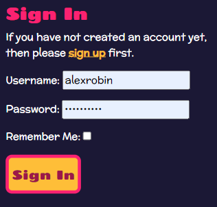

 [Wordwell](https://wordwellgame-bdb245abd266.herokuapp.com/)  was made as a project to showcase the full-stack skills of the website developer. The Django framework was used for the back-end. The front end was made with custon HTML, CSS and JavaScript and the bootstrap library.





## Table of Contents

1. <details open>
    <summary><a href="#ux">UX</a></summary>

    <ul>
    <li>
    <details>
    <summary>
        <a href="#goals">Goals</a>
    </summary>

    - [Visitor Goals](#visitor-goals)
    - [Business Goals](#business-goals)
    - [User Stories](#user-stories)
    </details>
    </li>

    <li><details open>
    <summary><a href="#visual-design">Visual Design</a></summary>

    - [Wireframes](#wireframes)
    - [Fonts](#fonts)
    - [Icons](#icons)
    - [Colors](#colours)
    </li>
    </ul>
    </details>
</details>

2. <a href="#database-models">Database models</a>


3.  <details open>
    <summary><a href="#features">Features</a></summary>

    <ul>

    <li>
    <summary><a href="#navbar">Navbar</a></summary>

    </li>

    <li>
    <summary><a href="#home-page">Home Page</a></summary>
    
    </li>
    
    <li><details>
    <summary><a href="Game">Game</a></summary>

    - [Board](#board)
    - [Guess Word Box](#guess-word-box)
    - [Word lists](#word-lists)
    - [Timer](#timer)
    - [Game Buttons](#game-buttons)

    </li>

    <li><details>
    <summary><a href="">Profile</a></summary>

    - [View Profile](#view-profile)
    - [Update Profile Form](#update-profile)

    </li>

    <li><details>
    <summary><a href="">Message Board</a></summary>

    - [Post List](#post-list)
    - [View Post](#view-post)
    - [Post Forms](#post-forms)
    - [Reply Forms](#reply-forms)
    - [Delete Modals](#delete-modals)

    </li>

    <li><details>
    <summary><a href="">High Scores page</a></summary>

    - [Login Form](#delete-post-button)

    </li>

    <li><details>
    <summary><a href="">Login Page</a></summary>
    - [Login Form](#delete-post-button)
    - [Login Button](#delete-post-modal)
    </li>

    <li><details>
    <summary><a href="">Signup Page</a></summary>
    - [Signup Form](#delete-post-button)
    - [Signup Button](#delete-post-modal)
    </li>

    <li><details>
    <summary><a href="">Logout Page</a></summary>
    - [Signup Button](#delete-post-modal)
    </li>

    </ul>

3. <details>
    <summary><a href="#technologies-used">Technologies Used</a></summary>

    - [Languages](#languages)
    - [Libraries](#libraries)
    - [Platforms](#platforms)
    - [Other Tools](#other-tools)

</details>

5. <a href="#testing">Testing</a></summary>

6. <a href="#future-improvements">Future Improvements</a>

7. <details>
    <summary><a href="#deployment">Deployment</a></summary>

    - [Clone Repository](#local-preparation)
    - [Deploy from Github](#local-instructions)
    
</details>

8. <details>
    <summary><a href="#credits">Credits</a></summary>

    - [Images](#images)
    - [sounds](#sounds)
    - [Code](#code)
    - [Testing](#testing)
</details>

# UX

## Visitor Goals

The target audience for Worwell are

- People who enjoy word games
- People who want to make social connections with other people of similar interests

User goals are:

- Have fun playing a word game
- Be able to replay the game as often as they like
- Be challenged to beat their best score
- Be challenged to beat the best scores of other users
- Make connections and interact with other users

Wordwell fills these needs by:

- Providing a word game for users to play
- Randomising the state of the board at the beginning of each game
- Allowing users to save their score, displaying their high score
- Displaying the high scores of all users
- Providing a message board for users to interact
- Providing a profile page to display information about each user

## Business Goals

The business goals of wordwell are:

- Provide a game to engage visitors of the website
- Provide a platform for visitors to interact with other players
- Showcase the skills of the website owner

## User Stories

### Implemented 

- As a user I can view all posts that have been created on the site that I can see posts made by other users, and posts I have created myself

- As a user I can create new posts so that I can ask questions or share information with other users on the site

- As a uiser I can view the content of posts made by other users so than I can interact with other users on the site

- As a user I can reply to posts in order to interact with other users on the site, and add relevant information

- As a user I can edit my post so that I can make changes or correct mistakes to my post

- As a user I can edit my reply so that I can update my message or correct mistakes

- As a user I can delete my posts so that I can remove content I have posted

- As a user I can delete my replies so that I can delete content I have posted as a reply

- As a player I can guess words so that I can score points in the game

- As a player, I can guess valid dictionary words on the game board to score points

- As a player, I can start a game timer so that I can guess as many words as possible before the timer runs out

- As a player I can save my score so that I can compare my high score with other users, and beat my own high score

- As a player I can see words sorted by lists of word length so that I can easily see how many words of each length I have found

- As a user I can reshuffle the letters on the board so that I can play a different board if I don't like the selection of letters

- As a user I can view the game board so that I can guess words to play the game

- As a user I can view the highscores of all users so that I can compare my score with the scores of other users

- As a user I can view my own and other users profiles, to see information about other users

- As a user I can edit my profile so that I can share information about myself with other users

- As a site user I can read the game instructions and overview of the website so that I know what the site is for and how to use it


#### Not implemented

- As a touch screen user, I can swipe letters on the board so that I can guess words

- As a player I can see my longest word so that I can try to beat my record.

- As a player I can see all of my scores, and those of other players so that I can compare my best scores with other players

- As user, I can view all posts made by users so that I can see a user's post history.


# Visual Design

## Wireframes


## Fonts

[Chango](https://fonts.google.com/specimen/Chango) was used for the headings.


[Mclaren](https://fonts.google.com/specimen/McLaren) Was used for the main text of the site. It was chosen to be less stylized and easier to read than the Chango font.


[Rubik](https://fonts.google.com/specimen/Rubik) was used for the game board. It was chosen no be very clean and easily readable.


## Icons

The favicon was made by taking a screen shoot of the W in the Wordwell logo.


## Colours


- #358270, #FEBE38, #FB2271 were the primary colours used for the site. 
- #358270 was the primary background colour, chosen to add colour but also be dark enough to contrast with the texts
- #FEBE38 was used for the navbar, buttons, and word boxes
- #FB2271 was used for headings, to make them stand add and add vibrance to the colour scheme
- #1B1835 was used as a secondary background colour, to contrast slightly with the main background colour
- #418141 and #A35050 were used for the edit and delete buttons
- #C57F7f was used as a secondary heading colour for the profile pages

# Database Models

- The UserProfile model was created to extend the in-built user model of the django allauth package. The user field is a one to there is a one to one relationship with the User Model. The profile object is created automatically when a new user is created, using Django signals. In the admin panel it is found under the user tab.
- The Scores model is used to store all player scores in the database. It is related to the UserProfile model in a many to one relationship. The high score field of the UserProfile model is updated when a new score is created. 
- The Post model has a many to one relationship with the User Model.
- The reply model has a many to one relationship with both the Post Model and the User Model


## Features

### Navbar

The Navbar contains links to all pages. On the mobile view it is collapsed and can be expanded by clicking the burger icon. The login link is shown if a user is not logged in, otherwise the logout link is shown.


### Home Page
<div align="center">


</div>

### Game

#### Board

The letters on the game board are highlighted as the player types a word. All possible word paths are highlighted. If the player types a word that is not on the board, the letters are highlighted red. If the player types a word that is on the board and is found in the dictionary, the letters are highlighted green. Otherwise they are highlighted yellow.

<div align="center">


</div>

#### Guess Word Box

The guess word box displays a message to indicate the dictionary is loading when the page is first loaded. When the dictionary is loaded and the game is ready to start, a message prompts the play the start the game. When the game has started, a message to start typing is shown. As the player types, the letters are displaying in the box. When the player presses enter, the word is cleared.

<div align="center">


</div>

#### Word lists

When the player correctly guesses a word, they are added to the word lists, depending on the length of the words.

<div align="center">


</div>

#### Timer

The timer starts counting down from 100 when the player starts a game.

<div align="center">

</div>

#### Game Buttons

- The start button starts the game timer and allows the player to begin guessing words. It is hidden once the game is started.
- The reshuffle button reshuffles the letters on the board. It is hidden once the game is started.
- At the end of the game the restart button is visible. It reloads the page.
- The save score button appears at the end of the game if the user is logged in. It saves the players score to the database. If it is the players high score, the high score on their profile will be updated.

<div align="center">


</div>

### Profile

#### View Profile

The player profile page shows the players high score, when they joined, and their last login date. 

It also shows their profile picture, display name, and about me text, all of which can be edited by the user. The profiles of other users can be viewed by clicking on their names on the highscore board or the message boards.

<div align="center">


</div>

The edit profile button directs the user to the edit profile form

#### Update Profile Form

<div align="center">


</div>

The update profile button updates the user profile on the database (if the form is valid) and redirects the user to their profile page

<div align="center">

</div>

### Message Board

#### Post List

The main message board shows a paginated list of all posts, with 10 posts per page. The title, author, and number of replies is shown. On desktop, the date of the most recent reply (or the date of the post if there are no replies) is also shown.
The posts are sorted with the posts with the newest replies displayed at the top. A user can click on the title to view a post, or a username to see that user's profile.

<div align="center">



</div>

- The new post button directs the user to the new post form

<div align="center">

</div>

#### View Post

The view post page shows the title, author and text of the post at the tope of the page. All replies are shown beneath, with the oldest shown at the top. The author, text and date of each reply is shown. If the user is the author of the post, the edit and delete buttons are shown next to the post. If the user is the author of a reply, the edit and delete buttons are shown next to the reply.

<div align="center">


</div>

### Post forms

- The new post form allows the user to create a post title and text
- The edit post form is prepopulated with the text and title of the post and allows the user to edit the content
- The forms only validate if both fields are complete
- The forms only validate if the title is unique

<div align="center">


</div>

<div align="center">


</div>

- The submit button on the new post form creates the post object in the database, and redirects the user to the message board post list.
- The submit button on the edit post form updates the existing object the database, and redirects the user to the view post page.

<div align="center">

</div>

### Reply Forms

- The new reply form allows the user to create a reply text
- The edit reply form is prepopulated with the text of the reply and allows the user to edit the content
- The forms only validate if the text has been completed

<div align="center">


</div>

<div align="center">


</div>


- The submit button on the new reply form creates the reply object in the database, and redirects the user to the view post page.
- The update button on the new reply form update the existing reply object in the database, and redirects the user to the view post page.

<div align="center">


</div>

### Delete Modals

- The delete modals display a confirmation dialogue, to confirm is the user wants to delte a post/message
- The cancel button closes the modal
- The delete button deletes the post/reply from the database
- The post delete button redirects the user to the post list
- The reply delete button redirects the user to the view post page

<div align="center">


</div>

##

### High Scores

The high scores list displays a list of all users on the site. It shows the profile picture, display name, and high score of each user, ordered by high score, descending. The name of each user links to their user profile.

<div align="center">


</div>

### User Authorisation Pages

#### Login Page

The login page uses the standard Django-allauth template, with minor changes. The username input is restricted to 10 characters.

<div align="center">


</div>

#### Register Page

The register page use the standard Django-allauth template.

<div align="center">


</div>

#### Logout Page

The Logout page uses the standard Djanto-alluth template.

<div align="center">


</div>

# Technologies Used

## Languages

- HTML
    * Page markup
- CSS
    * Styling
- JavaScript
    * Game mechanics
    * Manipulating DOM content
- Python
    * Backend

## Libraries/Frameworks

- [Google Fonts](https://fonts.google.com)
    * Font Styles
- [Boostrap](https://getbootstrap.com/)
    * Responsivity
    * Modals
- [Django](https://www.djangoproject.com/)
    * Backend Framework

# Database

- [Neon Database](https://neon.tech/)
    * Database storage

## Platforms

- [Github](https://github.com/)
    * Storing code remotely and deployment
    * Agile Methodology
    * User Stories
- [Gitpod](https://gitpod.io/)
    * IDE for project development
- [Heroku](https://www.heroku.com/)
    * Deployment
- [Cloudinary](https://cloudinary.com/)
    * Image storage and processing

## Other Tools

### Image editing

- [cloudconvert](https://cloudconvert.com/png-to-ico)
    * Convert favicon image from .png to .ico format

### Planning tools

- [smart draw](https://app.smartdraw.com/)
    * Design Entity Relationship Diagram

- [Baslamiq](https://balsamiq.com/)
    * Wireframes

# Testing

see [TESTING.md](TESTING.md)

# Future Improvements

- Touch screen word guessing. The game requires a keyboard to play. In order to make the game more accessable on touch screens, I would like to implement swiping on the game board to guess words. However this proved to be technically challenging, due to the fact that swipe events are bound to the object they were initiated in. Due to time contraints, this idea was abandonded inside the scope of this project.

- A feature I would like to add is to allow players to play against each other in a game. However this would likely add a lot of complexity to the implementation and I currently don't have the knowledge of how to implement this. So I did not attempt to implement it for this project

# Deployment

Note: in order to deploy the game, you will need a copy of the creds.json file, which is not included in the github repository for security reasons.

## local deployment

### Clone the Repository

1. Open a terminal in the folder you want to clone the project to.

2. In the terminal type:

    ```
      git clone https://github.com/alexrobincrabbe/Wordwell
    ```

3. Change to the repository folder:

    ```
      cd .\Wordwell\
    ```
4. Install requirements:

    ```
      pip install -r requirements.txt

    ```

5. You will need to set up a database and cloudinary storage account. I used Neon database.

6. Create environment variables:
    
    ```
      touch env.py

    ```
7. Create a secret key, database URL, and Cloudinary URL variables in the eny.py

    ```
    import os

    os.environ.setdefault(
    "DATABASE_URL", "< Your Database URL >"
    )

    os.environ.setdefault(
    "SECRET_KEY", "< Your Secret Key >"
    )

    os.environ.setdefault(
    "CLOUDINARY_URL","< Your Cloudinary URL >"
    )

    ```

6. Deploy:

    ```
      pip3 manage.py runserver

    ```

## Deploying to Heroku

### Make a repository on Github

1. Open a terminal in the folder you want to clone the project to.
2. In the terminal type:

    ```
      git clone https://github.com/alexrobincrabbe/Wordwell
    ```

3. Change to the repository folder:

    ```
      cd .\Wordwell\
    ```

6. Remove the origin:

    ```
      git remote rm origin"
    ```

5. On Github, create a new repository with a name of your choosing.

6. Add your Github repository to the origin:

    ```
      git remote add origin < URL of your repository >
    ```

7. Push the files to your repository:

    ```
      git push --set-upstream origin main
    ```
### Heroku

1. You will need a Heroku account and to log into it

2. Click on New --> Create new app

3. Choose an app name, and your region --> click create app

4. Click on the setting tab

5. Click on Reveal Config Vars

6. Click one ADD, enter CLOUDINARY_URL, and enter the URL of your cloudinary account for the variable value

7. Click on ADD, enter DATABASE_URL and enter the URL of your DATABASE

8. Click on ADD, enter SECRET_KEY and enter a value of your choosing

9. Click on connect to github

10. Enter the path to your github repository

11. Click on deploy branch

# Credits

- I used the SOWOPODS dictionary, converted to JSON format for the game dictionary to check the validity of words.

- Thanks to my mentory Rory Patrick for all of his help on this project and the projects leading up to this one

- Thanks to Leda for correcting my numerous typos and filling up the message boards with nonsense


