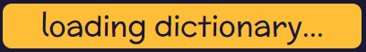
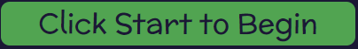

 [Wordwell](https://wordwellgame-bdb245abd266.herokuapp.com/)  was made as a project to showcase the full-stack skills of the website developer. The Django framework was used for the back-end. The front end was made with custon HTML, CSS and JavaScript and the bootstrap library.

## Table of Contents

1. 

    
<a href="#ux">UX</a>

    <ul>
    <li>
    

    

        <a href="#goals">Goals</a>
    

    - [Visitor Goals](#visitor-goals)
    - [Business Goals](#business-goals)
    - [User Stories](#user-stories)
    

    </li>

    <li>

    
<a href="#visual-design">Visual Design</a>

    - [Wireframes](#wireframes)
    - [Fonts](#fonts)
    - [Icons](#icons)
    - [Colors](#colours)
    </li>
    </ul>
    

2. <a href="#database-models">Database models</a>

3.  

    
<a href="#features">Features</a>

    <ul>

    <li>
    
<a href="#navbar">Navbar</a>

    </li>

    <li>
    
<a href="#home-page">Home Page</a>

    
    </li>
    
    <li>

    
<a href="Game">Game</a>

    - [Board](#board)
    - [Guess Word Box](#guess-word-box)
    - [Word lists](#word-lists)
    - [Timer](#timer)
    - [Game Buttons](#game-buttons)

    </li>

    <li>

    
<a href="">Profile</a>

    - [View Profile](#view-profile)
    - [Update Profile Form](#update-profile)

    </li>

    <li>

    
<a href="">Message Board</a>

    - [Post List](#post-list)
    - [View Post](#view-post)
    - [Post Forms](#post-forms)
    - [Reply Forms](#reply-forms)
    - [Delete Modals](#delete-modals)

    </li>

    <li>

    
<a href="">High Scores page</a>

    - [Login Form](#delete-post-button)

    </li>

    <li>

    
<a href="">Login Page</a>

    - [Login Form](#delete-post-button)
    - [Login Button](#delete-post-modal)
    </li>

    <li>

    
<a href="">Signup Page</a>

    - [Signup Form](#delete-post-button)
    - [Signup Button](#delete-post-modal)
    </li>

    <li>

    
<a href="">Logout Page</a>

    - [Signup Button](#delete-post-modal)
    </li>

    </ul>

3. 

    
<a href="#technologies-used">Technologies Used</a>

    - [Languages](#languages)
    - [Libraries](#libraries)
    - [Platforms](#platforms)
    - [Other Tools](#other-tools)

4. 

    
<a href="#testing">Testing</a>

    <ul>
    <li>

    
<a href="#methods">Methods</a>

    - [Validation](#validation)
    - [Mobile Testing](#mobile-testing)
    - [Desktop Testing](#desktop-testing)
    
</li>
    <li>

    
<a href="#bugs">Bugs</a>

    - [Unfixed Bugs](#unfixed-bugs)
    - [Fixed Bugs](#fixed-bugs)
    
</li>
    </li>
    </ul>

5. <a href="#future-improvements">Future Improvements</a>

6. 

    
<a href="#deployment">Deployment</a>

    - [Clone Repository](#local-preparation)
    - [Deploy from Github](#local-instructions)
    

7. 

    
<a href="#credits">Credits</a>

    - [Images](#images)
    - [sounds](#sounds)
    - [Code](#code)
    - [Testing](#testing)

# UX

## Visitor Goals

## Business Goals

## User Stories

- As a user I can view all posts that have been created on the site that I can see posts made by other users, and posts I have created myself
- As a user I can create new posts so that I can ask questions or share information with other users on the site
- As a uiser I can view the content of posts made by other users so than I can interact with other users on the site
- As a user I can reply to posts in order to interact with other users on the site, and add relevant information
- As a user I can edit my post so that I can make changes or correct mistakes to my post
- As a user I can edit my reply so that I can update my message or correct mistakes
- As a user I can delete my posts so that I can remove content I have posted
- As a user I can delete my replies so that I can delete content I have posted as a reply
- As a player I can guess words so that I can score points in the game
- As a player, I can guess valid dictionary words on the game board to score points
- As a player, I can start a game timer so that I can guess as many words as possible before the timer runs out
- As a player I can save my score so that I can compare my high score with other users, and beat my own high score
- As a player I can see words sorted by lists of word length so that I can easily see how many words of each length I have found
- As a user I can reshuffle the letters on the board so that I can play a different board if I don't like the selection of letters
- As a user I can view the game board so that I can guess words to play the game
- As a user I can view the highscores of all users so that I can compare my score with the scores of other users
- As a user I can view my own and other users profiles, to see information about other users
- As a user I can edit my profile so that I can share information about myself with other users
- As a site user I can read the game instructions and overview of the website so that I know what the site is for and how to use it

# Visual Design

## Wireframes

## Fonts

[Chango](https://fonts.google.com/specimen/Chango)

[Mclaren](https://fonts.google.com/specimen/McLaren)

[Rubik](https://fonts.google.com/specimen/Rubik)

## Icons

Favicon:

## Colours

# Database Models

- The UserProfile model was created to extend the in-built user model of the django allauth package. The user field is a one to there is a one to one relationship with the User Model. The profile object is created automatically when a new user is created, using Django signals. 
- The Scores model is used to store all player scores in the database. It is related to the UserProfile model in a many to one relationship. The high score field of the UserProfile model is updated when a new score is created. 
- The Post model has a many to one relationship with the User Model.
- The reply model has a many to one relationship with both the Post Model and the User Model

## Features

### Navbar

The Navbar contains links to all pages. On the mobile view it is collapsed and can be expanded by clicking the burger icon. The login link is shown if a user is not logged in, otherwise the logout link is shown.

### Home Page

### Game

#### Board

The letters on the game board are highlighted as the player types a word. All possible word paths are highlighted. If the player types a word that is not on the board, the letters are highlighted red. If the player types a word that is on the board and is found in the dictionary, the letters are highlighted green. Otherwise they are highlighted yellow.

#### Guess Word Box

The guess word box displays a message to indicate the dictionary is loading when the page is first loaded. When the dictionary is loaded and the game is ready to start, a message prompts the play the start the game. When the game has started, a message to start typing is shown. As the player types, the letters are displaying in the box. When the player presses enter, the word is cleared.

#### Word lists

When the player correctly guesses a word, they are added to the word lists, depending on the length of the words.

#### Timer

The timer starts counting down from 100 when the player starts a game.

#### Game Buttons

- The start button starts the game timer and allows the player to begin guessing words. It is hidden once the game is started.
- The reshuffle button reshuffles the letters on the board. It is hidden once the game is started.
- At the end of the game the restart button is visible. It reloads the page.
- The save score button appears at the end of the game if the user is logged in. It saves the players score to the database. If it is the players high score, the high score on their profile will be updated.

### Profile

#### View Profile

The player profile page shows the players high score, when they joined, and their last login date. 

It also shows their profile picture, display name, and about me text, all of which can be edited by the user. The profiles of other users can be viewed by clicking on their names on the highscore board or the message boards.

The edit profile button directs the user to the edit profile form

#### Update Profile Form

The update profile button updates the user profile on the database(if the form is valid) and redirects the user to their profile page

### Message Board

#### Post List

The main message board shows a paginated list of all posts, with 10 posts per page. The title, author, and number of replies is shown. On desktop, the date of the most recent reply (or the date of the post if there are no replies) is also shown.
The posts are sorted with the posts with the newest replies displayed at the top.

#### View Post

The view post page shows the title, author and text of the post at the tope of the page. All replies are shown beneath, with the oldest shown at the top. The author, text and date of each reply is shown. If the user is the author of the post, the edit and delete buttons are shown next to the post. If the user is the author of a reply, the edit and delete buttons are shown next to the reply.

### Post forms

- The new post form allows the user to create a post title and text
- The edit post form is prepopulated with the text and title of the post and allows the user to edit the content
- The forms only validate if both fields are complete
- The forms only validate if the title is unique

- The submit button on the new post form creates the post object in the database, and redirects the user to the message board post list.
- The update button on the edit post form updates the existing object the database, and redirects the user to the view post page.

### Reply Forms

- The new reply form allows the user to create a reply text
- The edit reply form is prepopulated with the text of the reply and allows the user to edit the content
- The forms only validate if the text has been completed

- The submit button on the new reply form creates the reply object in the database, and redirects the user to the view post page.
- The update button on the new reply form update the existing reply object in the database, and redirects the user to the view post page.

### Delete Modals

- The delete modals display a confirmation dialogue, to confirm is the user wants to delte a post/message
- The cancel button closes the modal
- The delete button deletes the post/reply from the database
- The post delete button redirects the user to the post list
- The reply delete button redirects the user to the view post page

##

### High Scores

### User authorization Page

