# Validation

## HTML

| Page | Screenshot | Notes |
| --- | --- | --- |
| Home Page | 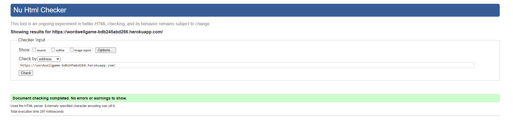 | pass: no errors |
| Game Page |  | pass: no errors |
| Message Board | 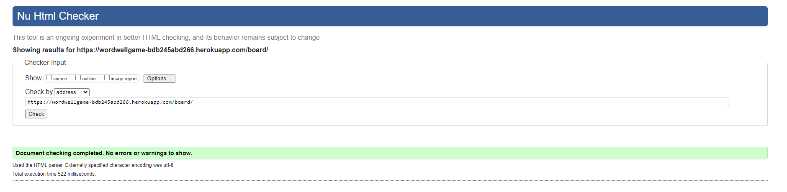 | pass: no errors |
| New Post |  | pass: no errors |
| View Post |  | pass: no errors |
| Edit Post |  | pass: no errors |
| New Reply |  | pass: no errors |
| Edit Reply |  | pass: no errors |
| View Profile | 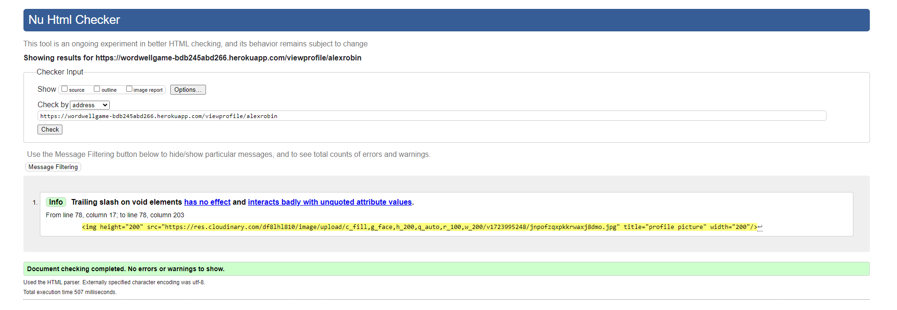 | pass: no errors |
| Update Profile | 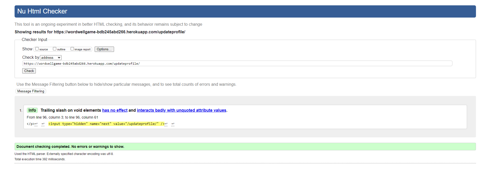 | pass: no errors |
| High Scores | 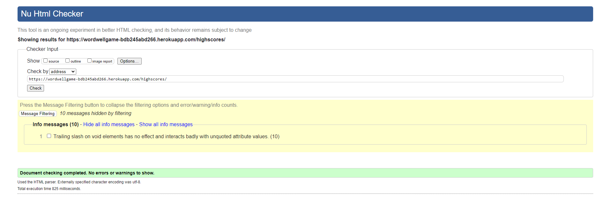 | pass: no errors |
| Login |  | pass: no errors |
| Signup | 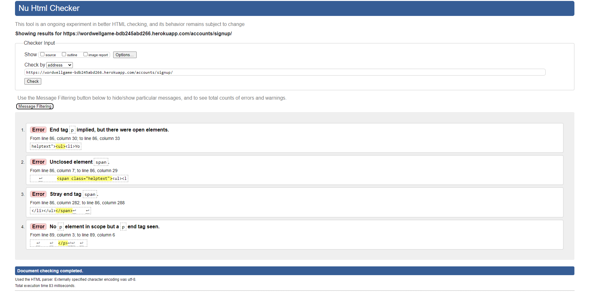 | pass: no errors |
| Logout |  | pass: no errors |

## CSS

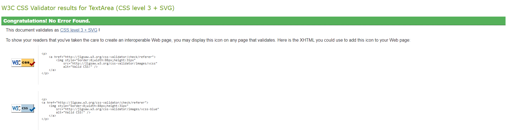

## Javascript

| Script | Screenshot | Notes |
| --- | --- | --- |
| game.js |  | pass: no errors |
| high_scores.js |  | pass: no errors |
| message_board.js |  | pass: no errors |
| update_profile.js |  | pass: no errors |
| view_post.js |  | bootstrap variables are defined in the bootstrap script |

## Python

### Game App

| Script | Screenshot |
| --- | --- |
| admin.py |  |
| apps.py | 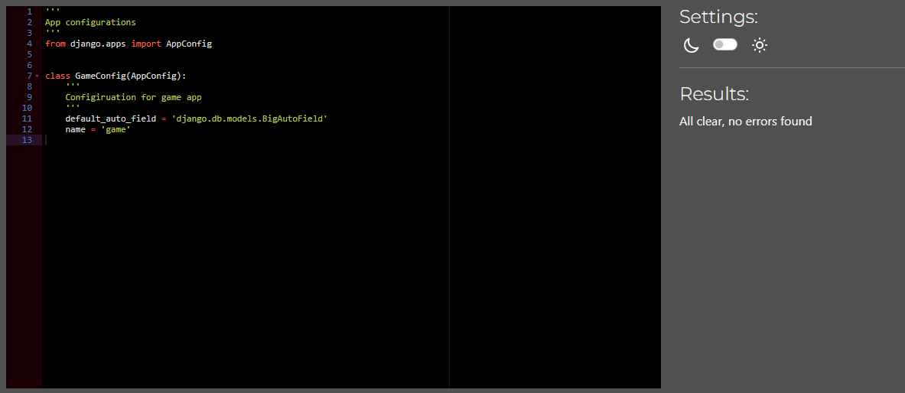 | 
| models.py |  |
| test_views.py |  |
| urls.py | 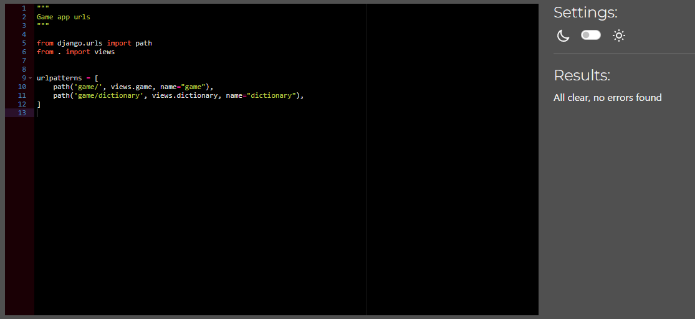 |
| views.py |  |

### High Scores App

| Script | Screenshot |
| --- | --- |
| apps.py | 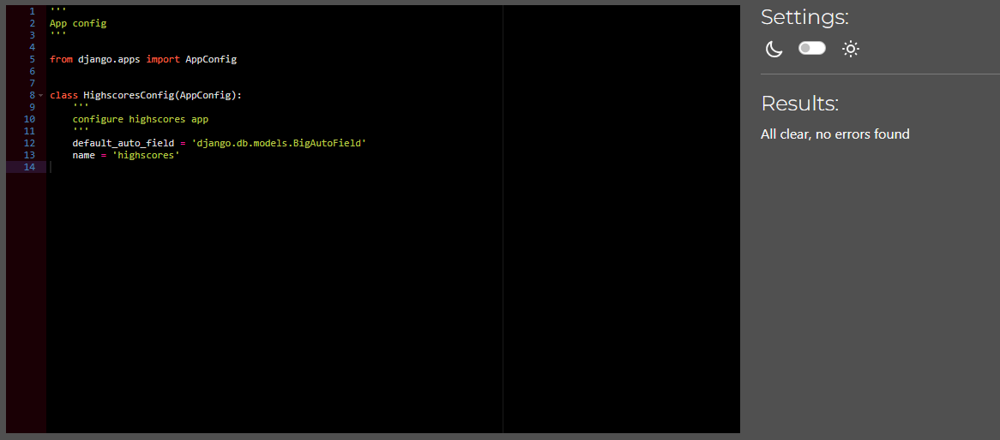 | 
| test_views.py | 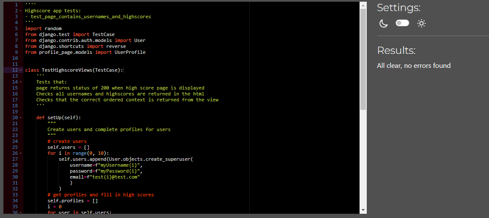 |
| urls.py | 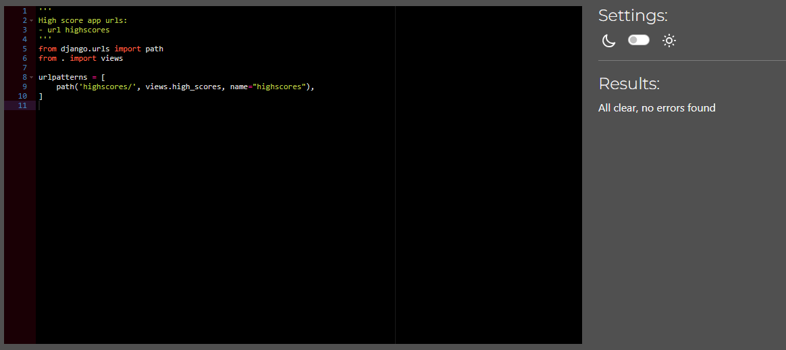 |
| views.py |  |

### Instructions App

| Script | Screenshot |
| --- | --- |
| apps.py |  | 
| test_views.py | 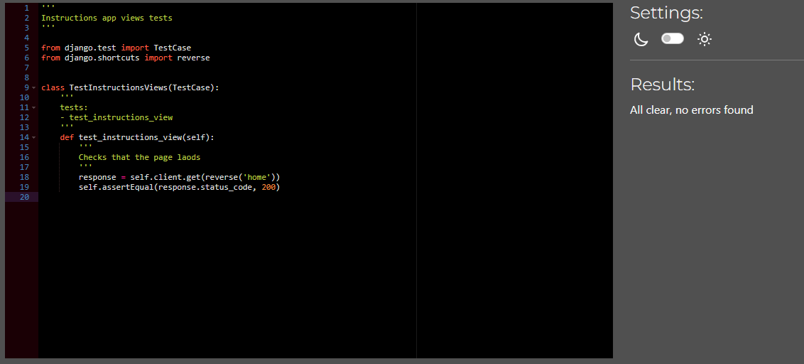 |
| urls.py |  |
| views.py |  |

### Message Board App

| Script | Screenshot |
| --- | --- |
| admin.py |  |
| apps.py |  | 
| forms.py | 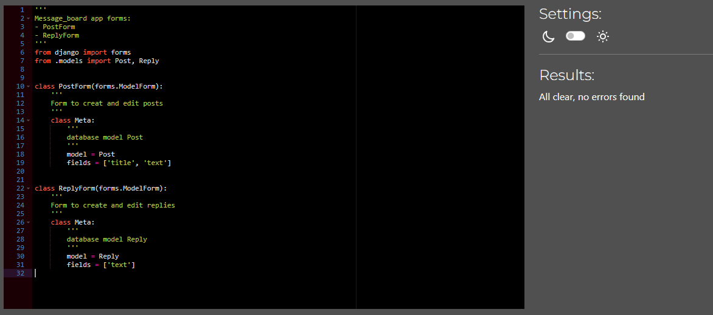 |
| models.py | 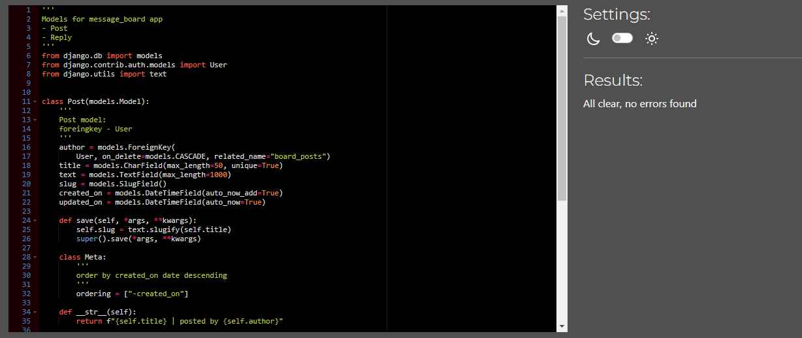 |
| test_forms.py | 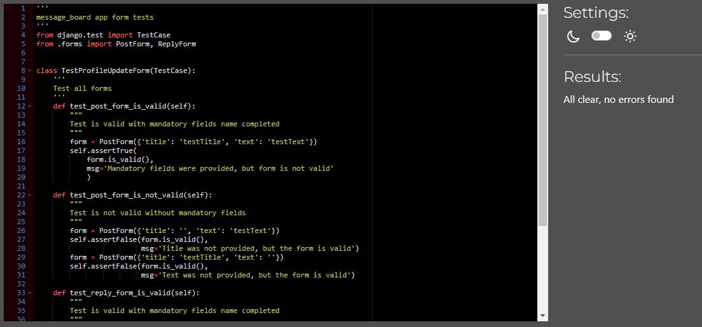 |
| test_views.py |  |
| urls.py | 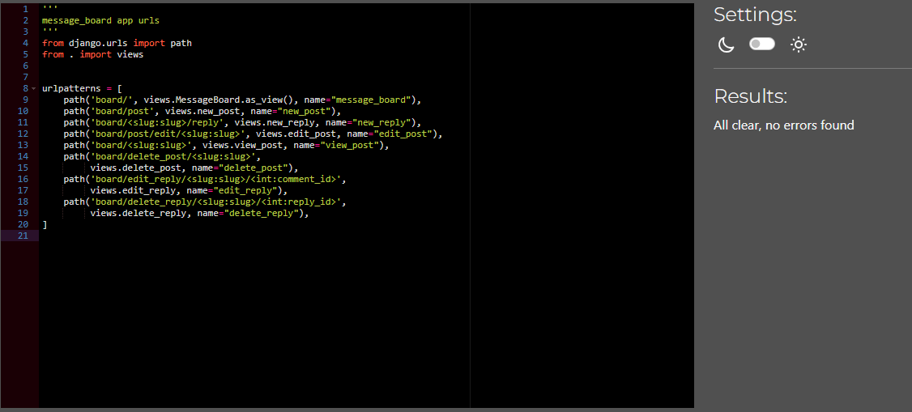 |
| views.py |  |

### Profile Page App

| Script | Screenshot |
| --- | --- |
| admin.py | 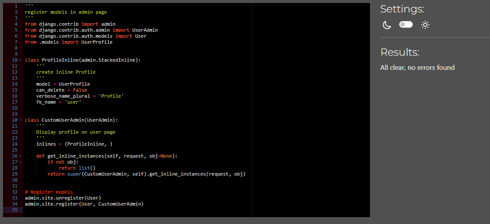 |
| apps.py |  | 
| forms.py |  |
| models.py |  |
| signals.py | 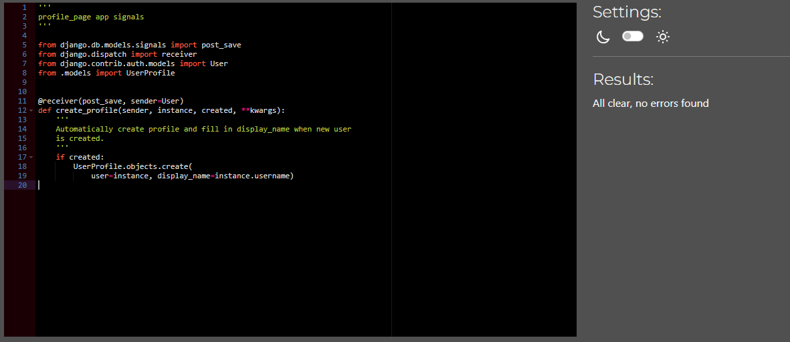 |
| test_forms.py | 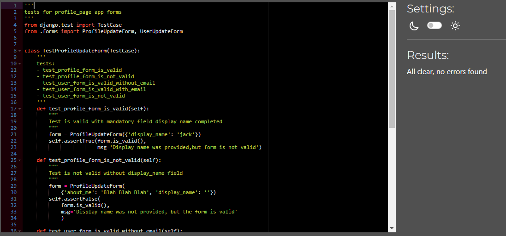 |
| test_views.py |  |
| urls.py | 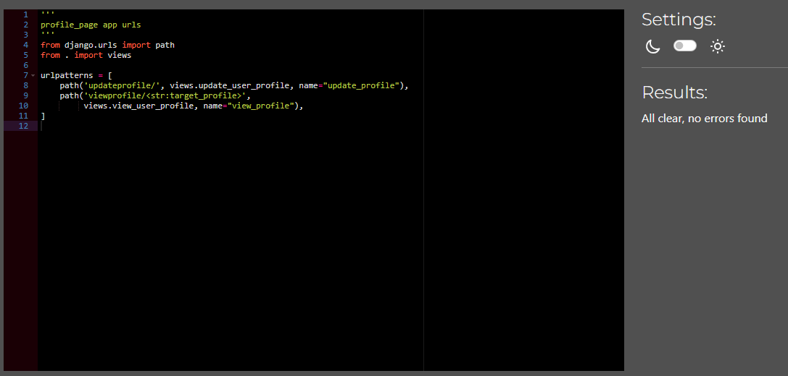 |
| views.py |  |

## Lighthouse Audit

| Page | Mobile | Desktop | Notes |
| --- | --- | --- | --- |
| Home Page |  | 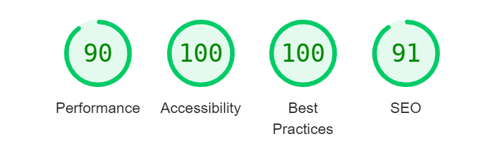
| Game Page |  | 
| Message Board | 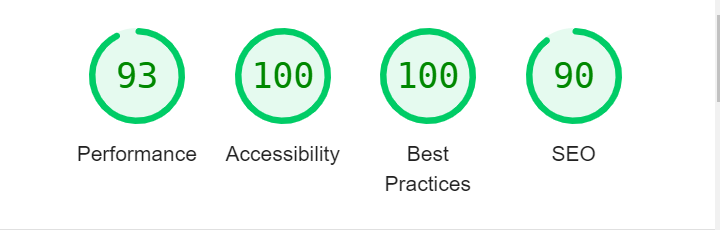 |  |
| New Post |  |  |
| View Post |  |  |
| Edit Post |  | 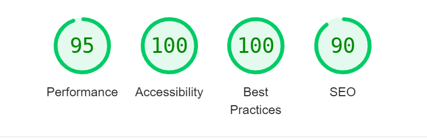 |
| New Reply |  |  |
| Edit Reply |  |  |
| View Profile |  | 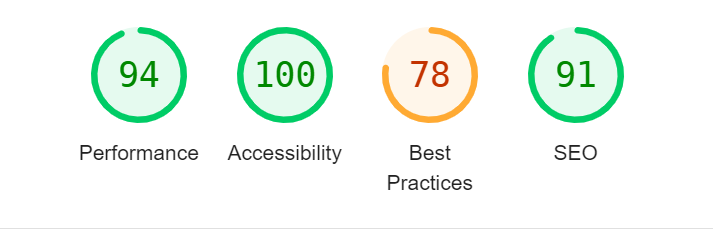 |
| Update Profile | 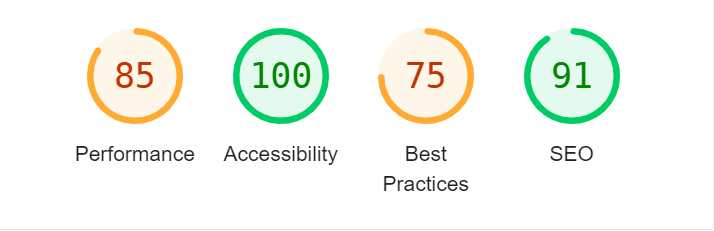 |  |
| High Scores |  |  |
| Login |  |  |
| Signup |  |  |
| Logout |  |  |

# Manual testing

## Logged in user

### Navbar

| Feature | Expectation | Result | Screenshot | 
| --- | --- | --- | --- |
| Home link | Opens the home page | Link works as expected | |
| Game link | Opens the game page | Link works as expected | |
| Message Board link | Opens the Message Board page | Link works as expected | |
| Profile Link | Opens the Profile page of the logged in user |Link works as expected | |
| Logout Link | Takes the user to the logout page | Link works as expected | |
| Login LInk | is hidden | Link is hidden as expected | |

### Home Page

| Feature | Expectation | Result | Screenshot | 
| --- | --- | --- | --- |
| Message board link | Opens the Message Board page | Link works as expected | |
| Login Link | Should be hidden when a user is already logged in | Link hidden when logged in | |

### Game Page

| Feature | Expectation | Result | Screenshot | 
| --- | --- | --- | --- |
| Start Button | The game timer starts. The user can begin guessing words | Link works as expected | |
| Reshuffle Button | Reshuffles the letters on the board | The letters on the board reshuffle when the button is clicked | |
| Timer | Counts down from 100 when the start button is clicked. Stops at zero. The | | |
| Guess box | The word is shown as the player types 
| Guess confirmation messages | When the player presses enter:the word and score is show if the word is valid, a message is shown that the word is invalid if it is not on the board or not in the dictionary, if the word has already been guessed, a message is shown that the word has already been guessed. | | |
| Board letters | The letters are highlighted as the player types. | Works as expected. | |
| Play again button | | | |
| Save score button | | | |
| Word lists| | | |

### Profile Page

| Feature | Expectation | Result | Screenshot | 
| --- | --- | --- | --- |
| Details | Shows the high score, join and last login dates | Link works as expected | |
| Profile Picture | Displays a place holder if no image is uploaded. Displays profile picture if one has been uploaded | | |
| About me | Displays the about me text if it has been completed, or none if it is blank | | |
| Edit Button |  If the user is the owner of the profile, opens the form page to edit the profile. Otherwise is hidden | | |

### Edit Profile Page

| Feature | Expectation | Result | Screenshot | 
| --- | --- | --- | --- |
| Form | submits only if: The display name has been completed, is unique, and a the email is valid(if given) |  | |
| Update button | When the button is clicked, if the form is valid, the user is redirected to their profile page, the profile is updated, and a confirmation message is shown | | |

### High score page

| Feature | Expectation | Result | Screenshot | 
| --- | --- | --- | --- |
| List of high scores | Shows all registered users, ordered by highscore. Display name and profile picture are shown for each user. The display name linke to the profile of the user |  | |

### Logout Page

| Feature | Expectation | Result | Screenshot | 
| --- | --- | --- | --- |
| Confirmation button | The user is logged out, redirected to the homepage, and a confirmation message is shown |  | |

### Message Board

| Feature | Expectation | Result | Screenshot | 
| --- | --- | --- | --- |
| New Post button | The new post form page is opened |  | |
| list of posts | A paginated list of posts is shown, with 10 posts per page. The title, author and number of replies are shown. The posts are ordered by the time of the most recent reply, or if there are no reply, the create date of the post is used. The newest are shown at the top of the page. When a user clicks on the title, they are taken the the view post page. | | |

### New Post

| Feature | Expectation | Result | Screenshot | 
| --- | --- | --- | --- |
| Form | The form validates if all fields are completed, and the title is unique |  | |
| submit button | The user is redirected to the message board, a confirmation message is shown, the post appears at the top of the list of posts | | |

### View Post

| Feature | Expectation | Result | Screenshot | 
| --- | --- | --- | --- |
| Post | The title, author and body of the post are shown at the top of the page|  | |
| replies | All replies are shown beneath the post, which the oldest at the top. The name, text and creation date of each post are shown|  | |
| Reply button | When clicked, the user is directed to the new reply page | | |
| edit post button | if the user is the author of the post, the button is displayed. When clicked the user is directed to the edit post form page | | |
| delete post button | if the user is the author of the post, the button is displayed. When clicked, the delete post modal is shown | | |
| Reply button | When clicked, the user is directed to the new reply page | | |
| edit reply button | if the user is the author of the reply, the button is displayed. When clicked the user is directed to the edit reply form page | | |
| delete reply button | if the user is the author of the reply, the button is displayed. When clicked, the delete reply modal is shown | | |
| Delete Post modal | a modal appears prompting the user to delete their post. If delete button is clicked, the user is redirected to the message board page, a confirmation message is shown, and the post is deleted | | |
| Delete Reply Modal | a modal appears prompting the user to delete their reply. If delete button is clicked, the user is redirected to the view post page, a confirmation message is shown, and the reply is deleted | | |

### Edit Post

| Feature | Expectation | Result | Screenshot | 
| --- | --- | --- | --- |
| Form | The title and text are prepopulated with the post content. The form validates when all fields are complete, and the title is unique |  | |
| Submit button | The user is redirected to the view post page, a confirmation message is show, the post is updated | | |

### New reply
| Feature | Expectation | Result | Screenshot | 
| --- | --- | --- | --- |
| Post | The title, author and body of the post are shown at the top of the page|  | |
| form | The form validates if the text is completed | | |
| Submit Button | The user is redirected to the view post page, a confirmation message is shown, the reply is shown | | |

### Eidt reply
| Feature | Expectation | Result | Screenshot | 
| --- | --- | --- | --- |
| Post | The title, author and body of the post are shown at the top of the page|  | |
| form | The form is prepopulated with the reply text. The form validates if the text is completed | | |
| Submit Button | The user is redirected to the view post page, a confirmation message is shown, the reply is updated | | |

## Guest user

### Navbar

| Feature | Expectation | Result | Screenshot | 
| --- | --- | --- | --- |
| Profile Link | Link is hidden |Link is hidden as expected | |
| Logout Link | Link is hidden | Link is hidden as expecte | |
| Login link| User is directed to the login page| Link works as expected | |

### Login Page

| Feature | Expectation | Result | Screenshot | 
| --- | --- | --- | --- |
| Sign in form | validates if the username and password are valid | |
| Sign in button | the user is redirected to the home page, logged in, and a confirmation message is shown |Link is hidden as expected | |
| Sign up link | When clicked, the user is directed to the sign up page | Link works as expected | |

### Sign Up Page

| Feature | Expectation | Result | Screenshot | 
| --- | --- | --- | --- |
| Sign up form | validates if the username is unique, password is valid and passwords match, email is valid(if given) | |
| Sign up button | When clicked, the user is directed to the home page, the user is logged in and a confirmation message is shown | Link works as expected | |

### Home page

| Feature | Expectation | Result | Screenshot | 
| --- | --- | --- | --- |
| Login link | The link is show, and the user is directed to the login page when it is clicked | Link works as expected | |

### Game Page

| Feature | Expectation | Result | Screenshot | 
| --- | --- | --- | --- |
| Save score button | The button remains hidden when the timer runs down | Button is hidden as expected | |

### Message board

| Feature | Expectation | Result | Screenshot | 
| --- | --- | --- | --- |
| Login Link | The login link is shown, and the user is directed to the login page when it is clicked | | |
| New post Button | The button should be hidden | The button is hidden as expected | |

### View Post

| Feature | Expectation | Result | Screenshot | 
| --- | --- | --- | --- |
| Login Link | The login link is shown, and the user is directed to the login page when it is clicked | | |
| Reply Button | The button should be hidden | The button is hidden as expected | |

