## Table of Contents

1. 

    
<a href="#validation">Validation</a>

    <ul>
    <li>
        <a href="#html">HTML</a>
    </li>

    <li>
        <a href="#css">CSS</a>
    </li>

     <li>
        <a href="javascript">JavaScript</a>
    </li>

     <li>
        <a href="#python">Python</a>
    </li>

    <li>
        <a href="#lighthouse-audit">Lighthouse Audit</a>
    </li>

    </ul>

2. 

    
<a href="#manual-testing">Manual Testing</a>

    <ul>
    <li>
        <a href="#logged-in-user">Logged in User</a>
    </li>

    <li>
        <a href="#guest-user">Guest User</a>
    </ul>

3.  
<a href="#automated-testing">Automated testing</a>

# Validation

## HTML

| Page | Screenshot | Notes |
| --- | --- | --- |
| Home Page |  | pass |
| Game Page | 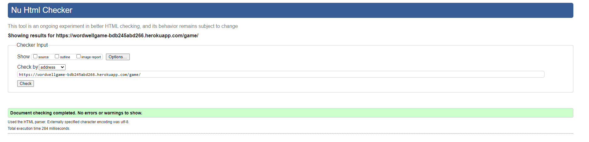 | pass |
| Message Board |  | pass |
| New Post | 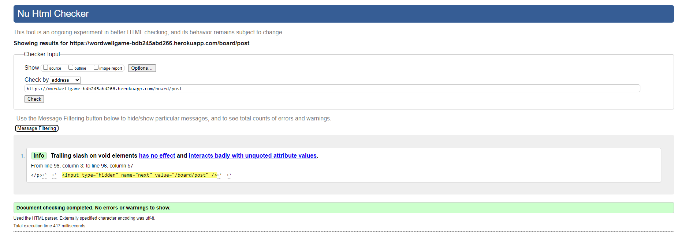 | pass |
| View Post |  | pass |
| Edit Post |  | pass |
| New Reply |  | pass |
| Edit Reply | 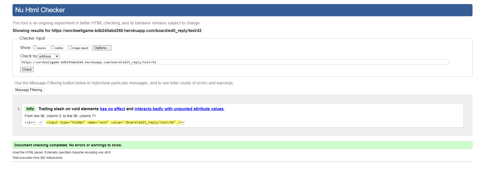 | pass |
| View Profile |  | pass |
| Update Profile |  | pass |
| High Scores |  | pass |
| Login |  | pass |
| Signup |  | errors are from HTML generated by the Djang.allauth template, not in my custom code|
| Logout | 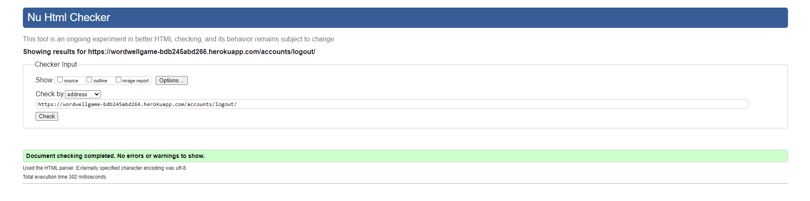 | pass: no errors |

## CSS

## Javascript

| Script | Screenshot | Notes |
| --- | --- | --- |
| game.js |  | pass: no errors |
| high_scores.js |  | pass: no errors |
| message_board.js | 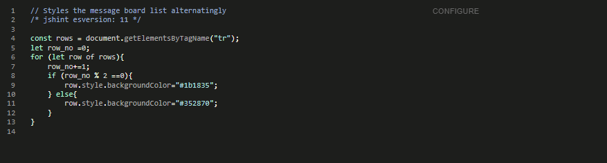 | pass: no errors |
| update_profile.js |  | pass: no errors |
| view_post.js | 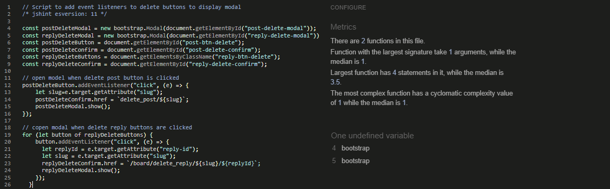 | bootstrap variables are defined in the bootstrap script |

## Python

### Game App

| Script | Screenshot |
| --- | --- |
| admin.py | 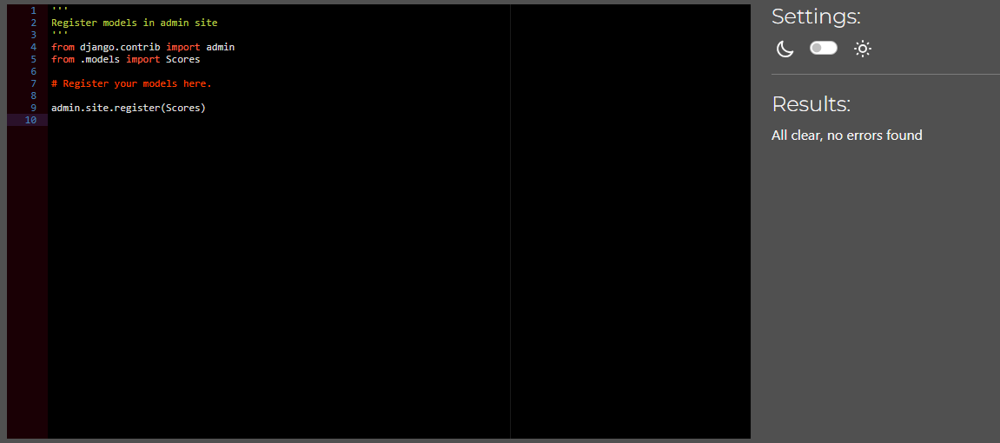 |
| apps.py |  | 
| models.py | 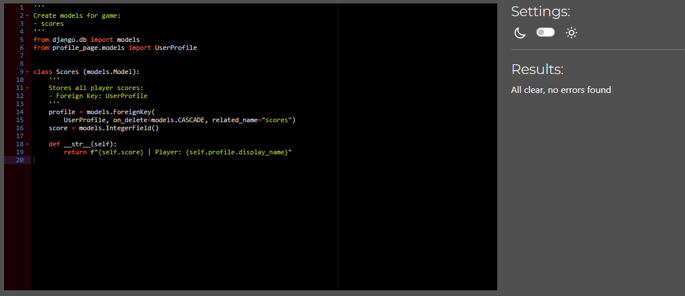 |
| test_views.py |  |
| urls.py |  |
| views.py | 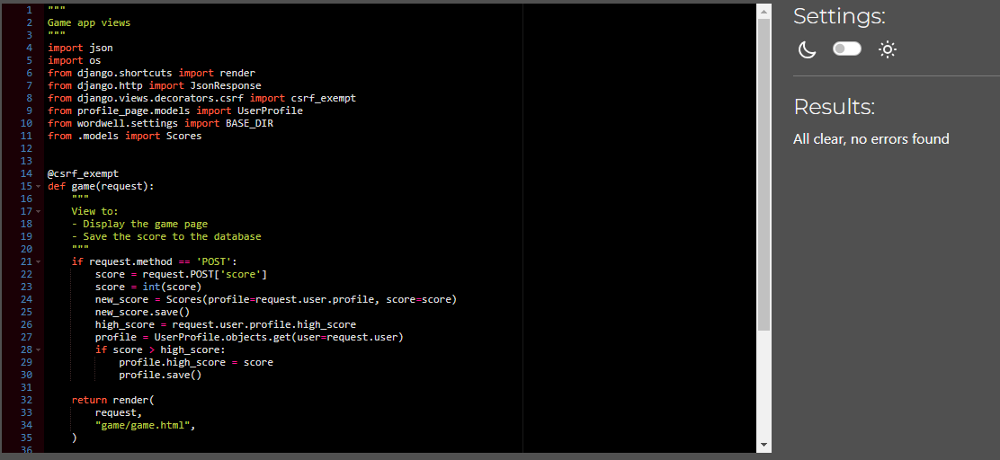 |

### High Scores App

| Script | Screenshot |
| --- | --- |
| apps.py |  | 
| test_views.py |  |
| urls.py |  |
| views.py | 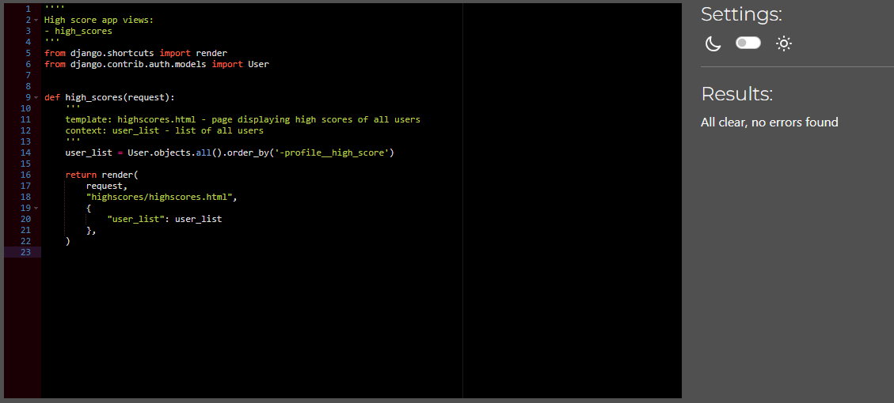 |

### Instructions App

| Script | Screenshot |
| --- | --- |
| apps.py | 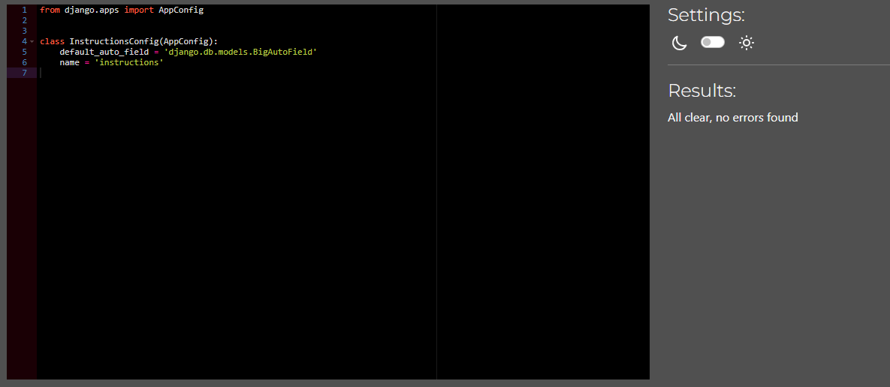 | 
| test_views.py |  |
| urls.py |  |
| views.py |  |

### Message Board App

| Script | Screenshot |
| --- | --- |
| admin.py | 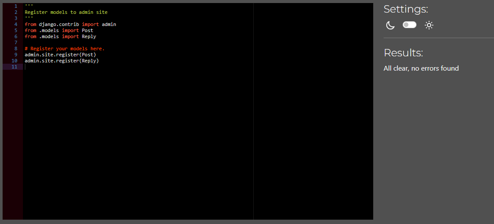 |
| apps.py |  | 
| forms.py |  |
| models.py |  |
| test_forms.py |  |
| test_views.py |  |
| urls.py |  |
| views.py |  |

### Profile Page App

| Script | Screenshot |
| --- | --- |
| admin.py |  |
| apps.py |  | 
| forms.py | 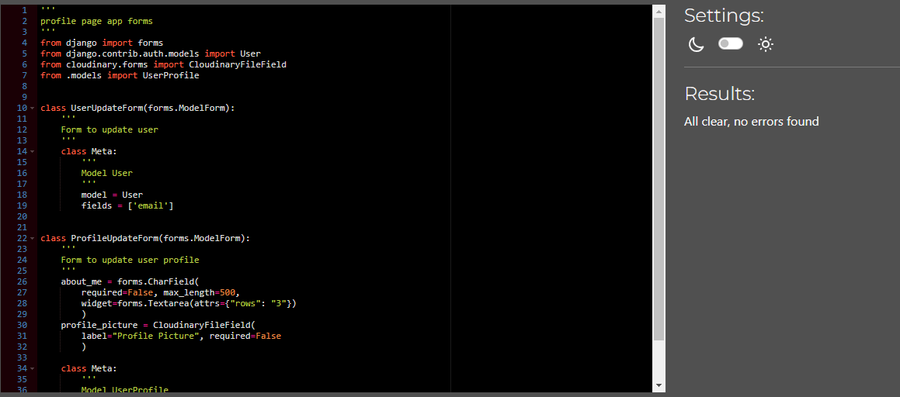 |
| models.py | 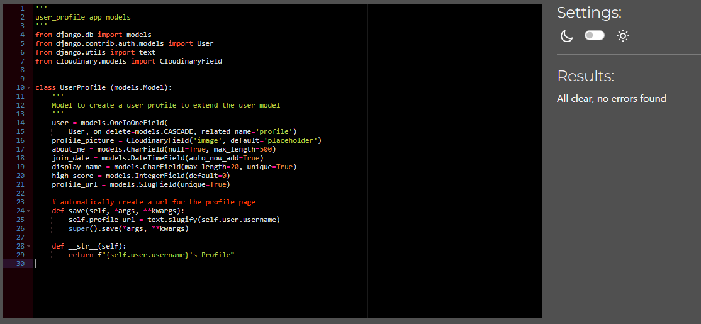 |
| signals.py |  |
| test_forms.py |  |
| test_views.py | 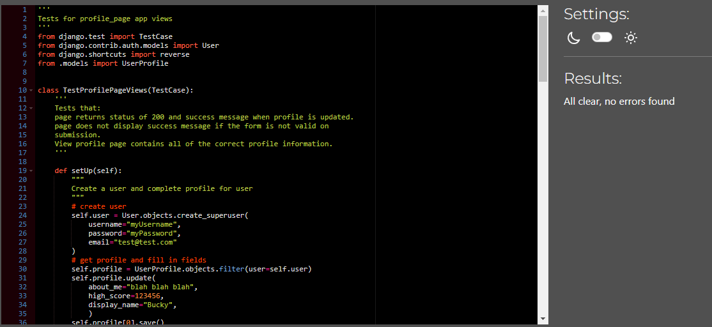 |
| urls.py |  |
| views.py |  |

## Lighthouse Audit

| Page | Mobile | Desktop | Notes |
| --- | --- | --- | --- |
| Home Page | 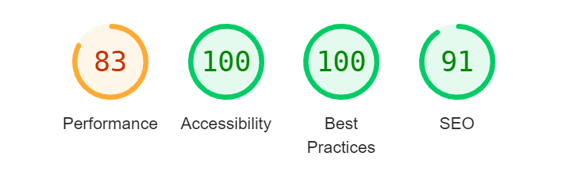 | 
| Game Page | 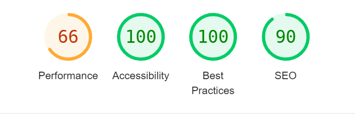 | 
| Message Board |  |  |
| New Post | 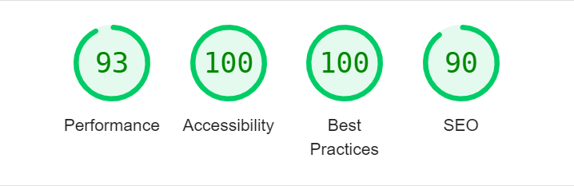 |  |
| View Post | 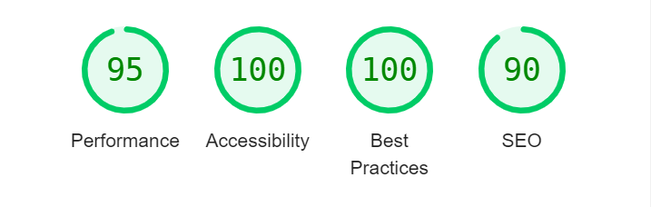 |  |
| Edit Post |  |  |
| New Reply | 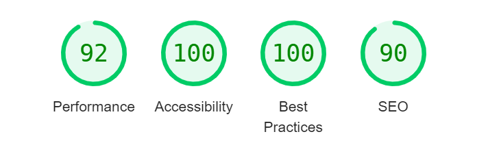 |  |
| Edit Reply |  |  |
| View Profile |  |  |
| Update Profile |  | 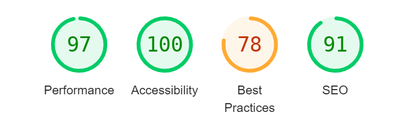 |
| High Scores |  | 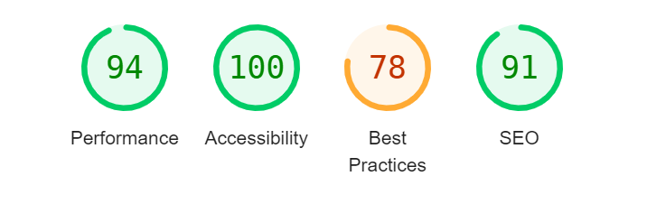 |
| Login |  | 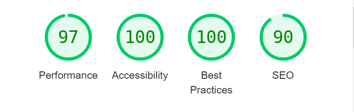 |
| Signup | 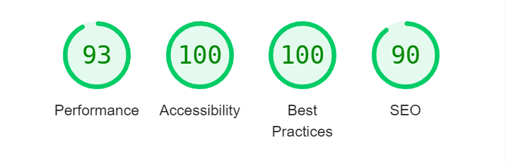 | 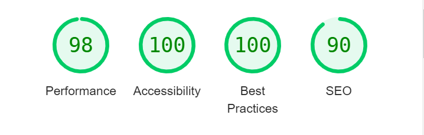 |
| Logout | 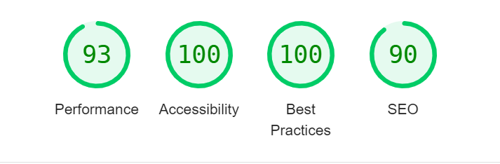 |  |

# Manual testing

## Logged in user

### Navbar

| Feature | Expectation | Result | Screenshots | 
| --- | --- | --- | --- |
| Home link | Opens the home page | Works as expected | |
| Game link | Opens the game page | Works as expected | |
| Message Board link | Opens the Message Board page | Works as expected | |
| Profile Link | Opens the Profile page of the logged in user | Works as expected | |
| Logout Link | Takes the user to the logout page | Works as expected | |
| Login LInk | is hidden | Link is hidden as expected |  |

### Home Page

| Feature | Expectation | Result | Screenshots | 
| --- | --- | --- | --- |
| Message board link | Opens the Message Board page | Works as expected | |
| Login Link | Should be hidden when a user is already logged in | Link hidden as expected |  |

### Game Page

| Feature | Expectation | Result | Screenshots | 
| --- | --- | --- | --- |
| Start Button | The game timer starts. The user can begin guessing words | Works as expected | |
| Reshuffle Button | Reshuffles the letters on the board | Works as expected |   |
| Timer | Counts down from 100 when the start button is clicked. Stops at zero. The player can no longer guess words when the timer stops. The play again and save score buttons are shown | works as expected | |
| Guess box | Shows a "dictionary loading message" when the dictionary is loading. Shows "press start" when the game is ready to start. Shows "star typing" when the game has started. The word is shown as the player types | Works as expected |     |
| Guess confirmation messages | When the player presses enter: the word and score is show if the word is valid, a message is shown that the word is invalid if it is not on the board or not in the dictionary, if the word has already been guessed, a message is shown that the word has already been guessed. | Works as expected|    |
| Board letters | The letters are highlighted as the player types. | Works as expected. |  |
| Play again button | reloads the page  | works as expected  | |
| Save score button | The score is saved to the databse, a confirmation message is shown|  Works as expected |   |
| Word lists| When a player presses enter and the word is valid, the word is added to the corresponding wordbox according to length|  Works as expected |  |

### Profile Page

| Feature | Expectation | Result | Screenshot | 
| --- | --- | --- | --- |
| Details | Shows the high score, join and last login dates | Works as expected | |
| Profile Picture | Displays a place holder if no image is uploaded. Displays profile picture if one has been uploaded | Works as expected | |
| About me | Displays the about me text if it has been completed, or none if it is blank |  Works as expected | |
| Edit Button |  If the user is the owner of the profile, opens the form page to edit the profile. Otherwise is hidden | Works as expected | |

### Edit Profile Page

| Feature | Expectation | Result | Screenshot | 
| --- | --- | --- | --- |
| Form | submits only if: The display name has been completed, is unique, and a the email is valid(if given) | Works as expected | |
| Update button | When the button is clicked, if the form is valid, the user is redirected to their profile page, the profile is updated, and a confirmation message is shown | Works as expected | |

### High score page

| Feature | Expectation | Result | Screenshot | 
| --- | --- | --- | --- |
| List of high scores | Shows all registered users, ordered by highscore. Display name and profile picture are shown for each user. The display name linke to the profile of the user | Works as expected | |

### Logout Page

| Feature | Expectation | Result | Screenshot | 
| --- | --- | --- | --- |
| Confirmation button | The user is logged out, redirected to the homepage, and a confirmation message is shown |  | |

### Message Board

| Feature | Expectation | Result | Screenshot | 
| --- | --- | --- | --- |
| New Post button | The new post form page is opened |  | |
| login link | Should be hidden if the user is logged in | link is hidden as expected | 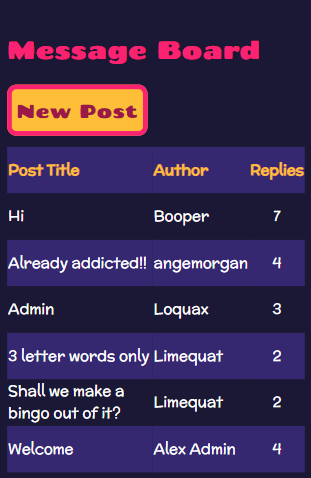 |
| list of posts | A paginated list of posts is shown, with 10 posts per page. The title, author and number of replies are shown. The posts are ordered by the time of the most recent reply, or if there are no reply, the create date of the post is used. The newest are shown at the top of the page. When a user clicks on the title, they are taken the the view post page. | Works as expected | |

### New Post

| Feature | Expectation | Result | Screenshot | 
| --- | --- | --- | --- |
| Form | The form validates if all fields are completed, and the title is unique | Works as expected | |
| submit button | The user is redirected to the message board, a confirmation message is shown, the post appears at the top of the list of posts | Works as expected | |

### View Post

| Feature | Expectation | Result | Screenshot | 
| --- | --- | --- | --- |
| Post | The title, author and body of the post are shown at the top of the page | Works as expected  | |
| replies | All replies are shown beneath the post, which the oldest at the top. The name, text and creation date of each post are shown| Works as expected | |
| Reply button | When clicked, the user is directed to the new reply page | Works as expected | |
| edit post button | if the user is the author of the post, the button is displayed. When clicked the user is directed to the edit post form page | Works as expected | |
| delete post button | if the user is the author of the post, the button is displayed. When clicked, the delete post modal is shown | Works as expected | |
| Reply button | When clicked, the user is directed to the new reply page | Works as expected | |
| edit reply button | if the user is the author of the reply, the button is displayed. When clicked the user is directed to the edit reply form page | Works as expected | |
| delete reply button | if the user is the author of the reply, the button is displayed. When clicked, the delete reply modal is shown | Works as expected | |
| Delete Post modal | a modal appears prompting the user to delete their post. If delete button is clicked, the user is redirected to the message board page, a confirmation message is shown, and the post is deleted | Works as expected | |
| Delete Reply Modal | a modal appears prompting the user to delete their reply. If delete button is clicked, the user is redirected to the view post page, a confirmation message is shown, and the reply is deleted | Works as expected | |

### Edit Post

| Feature | Expectation | Result | Screenshot | 
| --- | --- | --- | --- |
| Form | The title and text are prepopulated with the post content. The form validates when all fields are complete, and the title is unique | Works as expected | |
| Submit button | The user is redirected to the view post page, a confirmation message is show, the post is updated | Works as expected | |

### New reply
| Feature | Expectation | Result | Screenshot | 
| --- | --- | --- | --- |
| Post | The title, author and body of the post are shown at the top of the page| Works as expected | |
| form | The form validates if the text is completed | Works as expected | |
| Submit Button | The user is redirected to the view post page, a confirmation message is shown, the reply is shown | Works as expected | |

### Eidt reply
| Feature | Expectation | Result | Screenshot | 
| --- | --- | --- | --- |
| Post | The title, author and body of the post are shown at the top of the page | Works as expected | |
| form | The form is prepopulated with the reply text. The form validates if the text is completed |  Works as expected | |
| Submit Button | The user is redirected to the view post page, a confirmation message is shown, the reply is updated |  Works as expected | |

## Guest user

### Navbar

| Feature | Expectation | Result | Screenshot | 
| --- | --- | --- | --- |
| Profile Link | Link is hidden |Link is hidden as expected | |
| Logout Link | Link is hidden | Link is hidden as expecte |  |
| Login link| User is directed to the login page| works as expected | |

### Login Page

| Feature | Expectation | Result | Screenshot | 
| --- | --- | --- | --- |
| Sign in form | validates if the username and password are valid | Works as expected |
| Sign in button | the user is redirected to the home page, logged in, and a confirmation message is shown |Link is hidden as expected |  Works as expected |
| Sign up link | When clicked, the user is directed to the sign up page | Link works as expected | Works as expected |

### Sign Up Page

| Feature | Expectation | Result | Screenshot | 
| --- | --- | --- | --- |
| Sign up form | validates if the username is unique, password is valid and passwords match, email is valid(if given) | Works as expected |
| Sign up button | When clicked, the user is directed to the home page, the user is logged in and a confirmation message is shown | Link works as expected | Works as expected |

### Home page

| Feature | Expectation | Result | Screenshot | 
| --- | --- | --- | --- |
| Login link | The link is show, and the user is directed to the login page when it is clicked | Link works as expected | Works as expected |

### Game Page

| Feature | Expectation | Result | Screenshot | 
| --- | --- | --- | --- |
| Save score button | The button remains hidden when the timer runs down | Button is hidden as expected | Works as expected |

### Message board

| Feature | Expectation | Result | Screenshot | 
| --- | --- | --- | --- |
| Login Link | The login link is shown, and the user is directed to the login page when it is clicked | Works as expected | |
| New post Button | The button should be hidden | The button is hidden as expected | |

### View Post

| Feature | Expectation | Result | Screenshot | 
| --- | --- | --- | --- |
| Login Link | The login link is shown, and the user is directed to the login page when it is clicked | Works as expected | |
| Reply Button | The button should be hidden | The button is hidden as expected | |

# Automated Testing

I wrote automated tests for all views and forms.

## Game app

- The test checks that the page loads correctly
- that the score post data is saved to the databse.

## Highscores app

- The test checks that the page loads correcty
- That all usernames and high scores are displayed on the page
- That the context data is correctly ordered

## Instructions

- The test checks that the page loads correctly

## Message Board App

## Forms

- Tests that all forms submit when mandatory fields are complete
- Tests that all forms do not submit when a mandary field is not complete

### Views

- Setup creates 10 users, a post for each user, and a reply for each user to the first post
- Test that all titles and usernames are displayed on the post list
- Checks that all fields, and all replies are displayed on the view post page
- Checks that when a new post is submitted, the repsonse is redirected and a success message is shown
- Checks that the respose is not redirected if the new post form is not valid
- Checks that the edit post view returns a response status of 200, that the form is prepopulated with the correct database content, and that the content is hidden is the user is not the author of the post
- Checks that the edit post form redirects correctly if the form is valid
- Checks that the edit post form does not redirect if the form is not valid
- Also checks that the edit post form does not validate is the title is a duplicate (this has to be checked on the back end)
- Checks that the delete post view returns a success message, and the post is deleted from the databse, if the user is the author of a post
- Checks that the view returns a "permission denied" message if the user is not the author of a post, and that the post has not been deleted from the database
- Checks that the new reply view redirects, and that a success message is shown if the reply form is valid
- Checks that the new reply view does not redirect if the new reply form is not valid
-  Checks that the edit reply form is prepopulated with the correct database content, and the content is hidden if the user is not the author of the reply
- Checks that the edit reply view redirects when mandatory fields are complete
- Checks that the edit reply view does not redirect when a mandatory field is not complete
- Checks that the delete reply view redirects, shows a success message, and deletes the reply from the database, if the user is the author of the reply
- Checks that the delete reply view shows a permission denied message, and the reply if not deleted from the database, if the user is not the author of the reply

## Profile Page app

### Forms

- Tests form does not validate for each mandatory field if the field is not complete
- Tests form does not validate if the email is not a valid email
- Tests form validates if mandatory fields are complete
- Tests for validates if mandatory fields are complete and the email is valid

### Views

- Setup creates a user and a user profile
- Checks that the update view redirects and shows a success message if the update profile form is valid
- Checks that the update view does not redirect and does not show a success message if the update profile form is not valid
- Check that the profile page exists, and that all of the correct profile information is displayed on the profile page

