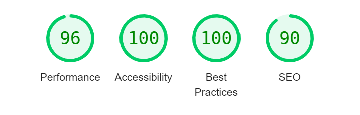

# Validation

## HTML

| Page | Screenshot | Notes |
| --- | --- | --- |
| Home Page |  | pass: no errors |
| Game Page |  | pass: no errors |
| Message Board |  | pass: no errors |
| New Post |  | pass: no errors |
| View Post |  | pass: no errors |
| Edit Post |  | pass: no errors |
| New Reply |  | pass: no errors |
| Edit Reply |  | pass: no errors |
| View Profile |  | pass: no errors |
| Update Profile |  | pass: no errors |
| High Scores |  | pass: no errors |
| Login |  | pass: no errors |
| Signup |  | pass: no errors |
| Logout |  | pass: no errors |

## CSS

## Javascript

| Script | Screenshot | Notes |
| --- | --- | --- |
| game.js |  | pass: no errors |
| high_scores.js |  | pass: no errors |
| message_board.js |  | pass: no errors |
| update_profile.js |  | pass: no errors |
| view_post.js |  | bootstrap variables are defined in the bootstrap script |

## Python

### Game App

| Script | Screenshot |
| --- | --- |
| admin.py |  |
| apps.py |  | 
| models.py |  |
| test_views.py |  |
| urls.py |  |
| views.py |  |

### High Scores App

| Script | Screenshot |
| --- | --- |
| apps.py |  | 
| test_views.py |  |
| urls.py |  |
| views.py |  |

### Instructions App

| Script | Screenshot |
| --- | --- |
| apps.py |  | 
| test_views.py |  |
| urls.py |  |
| views.py |  |

### Message Board App

| Script | Screenshot |
| --- | --- |
| admin.py |  |
| apps.py |  | 
| forms.py |  |
| models.py |  |
| test_forms.py |  |
| test_views.py |  |
| urls.py |  |
| views.py |  |

### Profile Page App

| Script | Screenshot |
| --- | --- |
| admin.py |  |
| apps.py |  | 
| forms.py |  |
| models.py |  |
| signals.py |  |
| test_forms.py |  |
| test_views.py |  |
| urls.py |  |
| views.py |  |

## Lighthouse Audit

| Page | Mobile | Desktop | Notes |
| --- | --- | --- | --- |
| Home Page |  | 
| Game Page |  | 
| Message Board |  |  |
| New Post |  |  |
| View Post |  |  |
| Edit Post |  |  |
| New Reply |  |  |
| Edit Reply |  |  |
| View Profile |  |  |
| Update Profile |  |  |
| High Scores |  |  |
| Login |  |  |
| Signup |  |  |
| Logout |  |  |

# Manual testing

## Logged in user

### Navbar

| Feature | Expectation | Result | Screenshot | 
| --- | --- | --- | --- |
| Home link | Opens the home page | Link works as expected | |
| Game link | Opens the game page | Link works as expected | |
| Message Board link | Opens the Message Board page | Link works as expected | |
| Profile Link | Opens the Profile page of the logged in user |Link works as expected | |
| Logout Link | Takes the user to the logout page | Link works as expected | |

